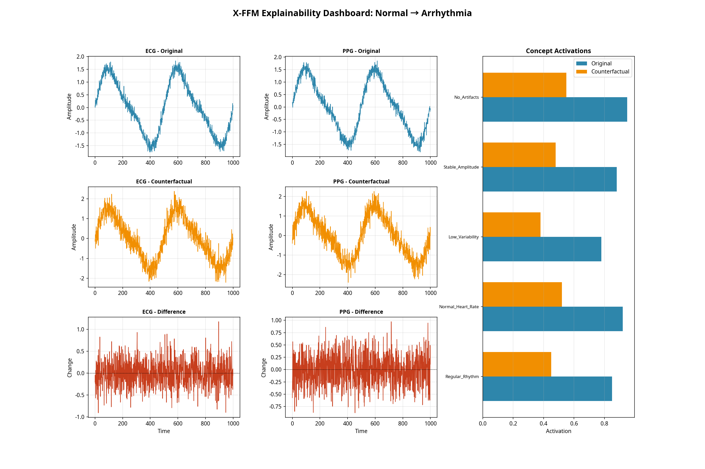

> **Note:** This is the official implementation of the research paper: **"X-FFM: Cross-Modal Interpretability and Explainability for Clinical Decision Support"**. The full paper can be found in `X-FFM_Research_Paper.md`.

# X-FFM: Cross-Modal Interpretability and Explainability for Clinical Decision Support

This repository provides the official source code and implementation for the **X-FFM** framework, a novel approach to building inherently interpretable and explainable AI models for multimodal biosignal analysis. Our framework is designed to bridge the gap between complex deep learning models and the need for transparent, trustworthy AI in clinical settings.



## Key Features

*   **Multimodal Fusion:** A robust Transformer-based encoder that effectively fuses information from multiple biosignal modalities (e.g., ECG, PPG).
*   **Concept Bottleneck Model:** The model is forced to learn high-level, human-understandable clinical concepts, making its internal reasoning transparent.
*   **Counterfactual Explanations:** Generates "what-if" scenarios to explain a prediction. For example, it can show the minimal change in an ECG signal required to flip a diagnosis from "Arrhythmia" to "Normal".
*   **Modular & Extensible:** The code is well-structured, making it easy to adapt for new datasets, modalities, or clinical concepts.

## Getting Started

### 1. Installation

We recommend using a virtual environment to manage dependencies.

```bash
# Clone the repository
# git clone https://github.com/your-username/X-FFM-Biosignal-Explainability.git
# cd X-FFM-Biosignal-Explainability

# Create and activate virtual environment
python3 -m venv venv
source venv/bin/activate

# Install dependencies
pip install -r requirements.txt
```

### 2. Data Preparation

To quickly test the framework, you can generate a synthetic dataset.

```bash
# This will create a sample dataset in ./data/synthetic/
python create_sample_data.py
```

For using your own data, please structure your files as described in the [USER_GUIDE.md](USER_GUIDE.md).

### 3. Running the Demos

*   **Visualization Demo (No Training Required):**

    This demo runs instantly and showcases the explainability features on a sample signal.

    ```bash
    python experiments/demo_visualization_only.py
    ```

    Check the `results/` folder for the output visualizations.

*   **Full Training Script:**

    This script trains the X-FFM model on the dataset. (Requires PyTorch to be installed).

    ```bash
    python experiments/train_xffm.py
    ```

    The best model will be saved in the `checkpoints/` directory.

## Citation

If you use this code or framework in your research, please consider citing our work:

```bibtex
@article{jirapattarasakul2025xffm,
  title   = {X-FFM: Cross-Modal Interpretability and Explainability for Clinical Decision Support},
  author  = {Sumetee Jirapattarasakul and Manus AI},
  journal = {arXiv preprint arXiv:XXXX.XXXXX},
  year    = {2025}
}
```

## License

This project is licensed under the MIT License. See the [LICENSE](LICENSE) file for details.
